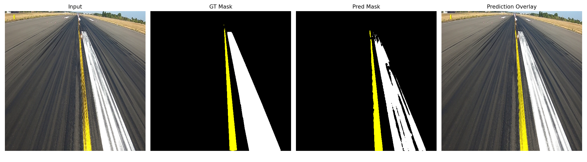
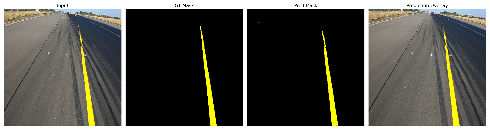
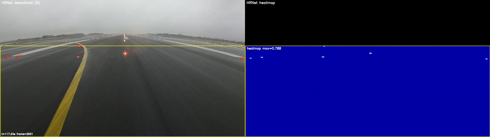

# Edge AI for Airport Marking Segmentation and AGL Localization

This repository contains code for deep-learning-based visual inspection of selected airport infrastructure elements.

The project covers two tasks:

- semantic segmentation of airport surface markings,
- point localization of Airfield Ground Lighting (AGL) lamps.

The implemented models include:

- U-Net,
- LinkNet with MobileNetV2,
- U-Net Point,
- HRNet-Lite-Point.

The models were evaluated on:

- Raspberry Pi 5,
- Raspberry Pi 5 with Hailo-8,
- NVIDIA Jetson AGX Orin.

## Example results

### Airport surface marking segmentation




### AGL lamp localization



## Dataset

The dataset used in this project is not publicly available.

Access may be provided for research purposes upon reasonable request. Please contact:

**Kacper Podbucki**  
kacper.podbucki@put.poznan.pl

## Repository structure

```text
AGL/               Training and evaluation of AGL lamp localization models
Tests_Raspberry/   Raspberry Pi 5 and Hailo-8 benchmarks
Tests_Orin/        NVIDIA Jetson AGX Orin benchmarks
```

## Notes

This repository contains research code used for model training, video inference and embedded-platform benchmarking. The system is intended to support visual inspection.

## Authors
- Bartłomiej Szalwach
- Kacper Podbucki
